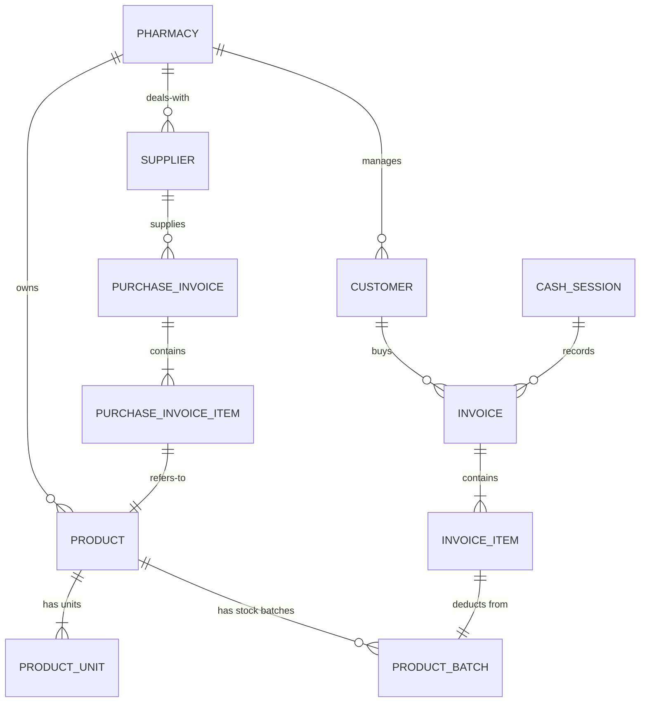

# 🗄️ PharmaFix Database Schema (Drift/SQLite)
> **Version:** 10.0 | **Last Updated:** 2026-05-03

هذا الملف يحتوي على الهيكل النهائي لقاعدة بيانات مشروع **PharmaFix**، وهو مصمم لدعم العمليات الصيدلانية المعقدة بنظام "أولاً بدون إنترنت" (Offline-First).

---

## 🏗️ المخطط العام (ERD Overview)

النظام مقسم إلى مجموعات منطقية من الجداول:

### 1. البنية الأساسية (Core Infrastructure)
*   **pharmacies:** بيانات الصيدلية (المستأجر/Tenant).
*   **users:** إدارة المستخدمين والصلاحيات.
*   **audit_logs:** سجل لمراقبة العمليات الحساسة.

### 2. إدارة المنتجات والمخزون (Product & Inventory)
*   **products:** الكتالوج الأساسي للأدوية (بدون أسعار).
*   **product_units:** الوحدات المتعددة (علبة، شريط) مع معامل التحويل وأسعار البيع والتكلفة.
*   **product_batches:** دفعات المخزون الحقيقية مع تواريخ الانتهاء والكميات المتبقية (FIFO).
*   **categories / manufacturers:** تصنيف الأدوية والشركات المصنعة.
*   **write_offs:** تتبع الهالك والتالف وإعدام المخزون.
*   **master_drugs:** قاموس الأدوية العالمي للمزامنة.

### 3. العمليات المالية والموردين (Suppliers & Purchases)
*   **suppliers:** بيانات الموردين وأرصدتهم الحالية.
*   **purchase_invoices:** فواتير المشتريات وتفاصيل المديونية.
*   **purchase_invoice_items:** الأصناف داخل فاتورة المشتريات.
*   **supplier_payments:** سجل المدفوعات النقدية للموردين.
*   **purchase_returns / purchase_return_items:** إدارة مرتجعات المشتريات للمورد.

### 4. المبيعات والعملاء (Sales & Customers)
*   **customers:** سجل العملاء وسقف الائتمان والديون.
*   **customer_payments:** سجل تحصيل الديون من العملاء.
*   **invoices:** فواتير المبيعات (POS).
*   **invoice_items:** الأصناف المباعة داخل الفاتورة.
*   **cash_sessions:** إدارة ورديات الكاشير (إغلاق وفتح الصندوق).
*   **sales_returns / sales_return_items:** إدارة مرتجعات المبيعات من العملاء.

---

## 🛠️ تفاصيل الجداول (Table Definitions)

### جدول المنتجات (`products`)
| الحقل | النوع | الوصف |
|---|---|---|
| id | Text (UUID) | المفتاح الأساسي |
| pharmacy_id | Text | ربط بالصيدلية |
| local_name | Text | اسم الدواء |
| scientific_name | Text | الاسم العلمي |
| barcode | Text | الباركود الدولي |
| min_stock_threshold | Real | حد إعادة الطلب |

### جدول الوحدات (`product_units`)
*يربط المنتج بأكثر من وحدة قياس.*
| الحقل | النوع | الوصف |
|---|---|---|
| id | Text | المفتاح الأساسي |
| product_id | Text (FK) | ربط بجدول المنتجات |
| unit_name | Text | (علبة، شريط، قرص) |
| conversion_factor | Real | عدد الحبات في هذه الوحدة |
| selling_price | Real | سعر البيع للجمهور |
| cost_price | Real | سعر التكلفة الفعلي |

### جدول دفعات المخزون (`product_batches`)
*المسؤول عن تتبع تواريخ الانتهاء والكميات الحقيقية.*
| الحقل | النوع | الوصف |
|---|---|---|
| id | Text | المفتاح الأساسي |
| product_id | Text (FK) | ربط بجدول المنتجات |
| batch_number | Text | رقم التشغيلة |
| expiry_date | DateTime | تاريخ الانتهاء |
| quantity_in_base_unit | Real | الكمية المتبقية (بالوحدة الصغرى) |
| purchase_price | Real | سعر الشراء لهذه الدفعة |

---

## 🔗 العلاقات الأساسية (Key Relationships)

1.  **Product → Units (1:N):** الدواء الواحد له عدة وحدات (علبة تحتوي 3 شرائط).
2.  **Product → Batches (1:N):** الدواء الواحد قد يكون له عدة دفعات بتواريخ انتهاء مختلفة.
3.  **Supplier → Purchase Invoices (1:N):** المورد الواحد له سجل فواتير مشتريات.
4.  **Customer → Invoices (1:N):** العميل الواحد له سجل فواتير مبيعات (ديون).
5.  **Invoice → Invoice Items (1:N):** الفاتورة الواحدة تحتوي على عدة أصناف مباعة.

---

## 📜 قواعد البيانات (Database Rules)
*   **SSOT:** قاعدة البيانات المحلية هي المصدر الوحيد للحقيقة لواجهة المستخدم.
*   **UUID:** يتم استخدام UUID للمفاتيح الأساسية لضمان عدم تضارب البيانات عند المزامنة مع السحابة.
*   **FIFO:** يتم خصم الكميات من الدفعات الأقدم دائماً.
*   **Immutable:** الفواتير (بيع/شراء) غير قابلة للتعديل؛ يتم الإلغاء العكسي وإصدار فاتورة جديدة.
